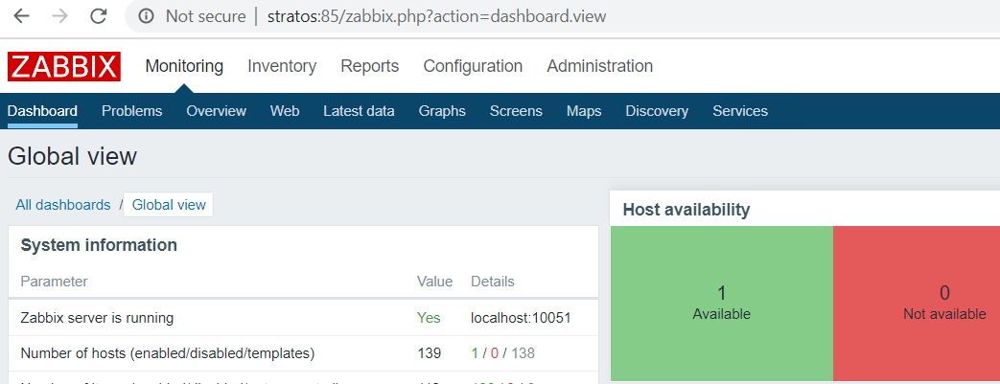

# <!--fit--> Docker without docker

https://github.com/mchugh19/without-docker

---


# About me

#### Christian McHugh ([@mchugh19](https://github.com/mchugh19))

Interested in automation, DevOps, Organization change
Free software contributor
</br>
##### Author
https://github.com/mchugh19/zabbix-vue
https://github.com/jenkinsci/saltstack-plugin/
Saltstack contributor

---

# Concerns
- Docker runs as a root service and is accessed through an api/socket (bypasses audit tracing, and complicates service management)
- Containers run without cgroup limits and with default capabilities
- Difficult to leverage additional namespacing
- Upstream hostile to integration
- Partial support for running non-root

---

# Alternatives
- systemd-nspawn
- podman
  - buildah

---
<!-- _class: nspawn -->

# systemd-nspawn

### Use-case: Windows app in wine
Don't want to clutter main OS with wine and Windows files

Container allows for super chroot and snapshot capability. The nspawn container can be cloned, upgraded, and reverted if needed.

Services inside the nspawn container can be managed like any other


---
<!-- _class: nspawn -->

# nspawn wine container

Example service files: [blueiris](assets/blueiris.service) [vnc](assets/vnc.service) [xvfb](assets/xvfb.service)
`machinectl start blueiris`
`journalctl -M blueiris -u blueiris`

```none
# systemctl -M blueiris status blueiris
● blueiris.service - Blueiris Server
   Loaded: loaded (/etc/systemd/system/blueiris.service; enabled; vendor preset: enabled)
   Active: active (running) since Sun 2020-02-23 10:26:43 GMT; 1min 26s ago
 Main PID: 45
   CGroup: /system.slice/blueiris.service
           ├─45 /root/.wine/drive_c/Program Files/Blue Iris 5/BlueIris.exe
           ├─49 /opt/wine-stable/bin/wineserver
           ├─65 C:\windows\system32\services.exe
           ├─68 C:\windows\system32\plugplay.exe
           ├─70 C:\windows\system32\explorer.exe /desktop
           ├─77 C:\windows\system32\winedevice.exe
           └─85 C:\windows\system32\winedevice.exe
```

---
<!-- _class: nspawn -->

# nspawn container filesystem

In addition to OCI images (extracted tar files with overlayfs directories), nspawn can also use raw images, gpt partitioned images, and directories.

When you don't need robust version artifacts, this offers significantly less overhead.


```none
# ls -l /var/lib/machines/blueiris/
drwxr-xr-x 1 1502347264 1502347264    0 Nov 10 12:17 boot
drwxr-xr-x 1 1502347264 1502347264  128 Jan 28 20:51 dev
drwxr-xr-x 1 1502347264 1502347264 2106 Feb 18 06:21 etc
drwxr-xr-x 1 1502347264 1502347264    0 Nov 10 12:17 home
drwxr-xr-x 1 1502347264 1502347264    0 Nov 10 12:17 proc
drwx------ 1 1502347264 1502347264  358 Feb 18 06:26 root
drwxr-xr-x 1 1502347264 1502347264   26 Jan 28 20:52 run
drwxr-xr-x 1 1502347264 1502347264    0 Jan 28 20:52 srv
drwxr-xr-x 1 1502347264 1502347264    0 Nov 10 12:17 sys
drwxrwxrwt 1 1502347264 1502347264    0 Jan 28 20:52 tmp
drwxr-xr-x 1 1502347264 1502347264  102 Jan 28 20:52 usr
drwxr-xr-x 1 1502347264 1502347264   90 Jan 28 20:52 var
```

---
<!-- _class: podman -->

# Podman

- Uses fork/exec
- Integration with systemd. (Configures needed directory and cgroup mounts)
  ```
  FROM fedora
  RUN dnf -y install httpd; dnf clean all; systemctl enable httpd
  EXPOSE 80
  CMD [ "/sbin/init" ]
  ```
- Supports sd_notify
- Socket activation
- Generate systemd unit files `podman generate systemd --name foo`

---
<!-- _class: podman -->

# Podman Summary
`alias docker=podman`

```none
podman pull nginx
podman images
podman run -dt --rm -p 1080:80 nginx # run as unprivileged user!
podman ps
podman rm 3cd983c74719
podman rmi nginx
```

---
<!-- _class: podman -->

# Podman pod support!

Where docker uses it's own `--link` implementation to allow containers to be network visible to each other, podman allows the use of network namespaces or pods.

There is [a project](https://github.com/containers/podman-compose) to allow podman to run simple docker compose files, but the native implementation is Kubernetes deployment files.

---
<!-- _class: podman -->

# Generating deployment files

Example running two containers (Zabbix server and agent) which are able to communicate with each other, with ports connected to the outside.
```
# podman pod create -n zabpod -p 10051:10051 -p 85:80
# podman run --name zabbix --pod zabpod -d zabbix/zabbix-appliance
# podman run --name zabbix-agent --pod zabpod -e ZBX_HOSTNAME="zabbix-server" -e ZBX_SERVER_HOST="localhost" -d zabbix/zabbix-agent
```

Generate a kubernetes deployment manifest
` podman generate kube zabpod > zabbix.yaml`

[zabbix.yaml](assets/zabbix.yaml)

---
<!-- _class: podman -->

# Kubernetes deployment files

It works!


Processes are running as my user
`xian     19152 19133  0 09:19 ?        00:00:00 /usr/sbin/zabbix_agentd --foreground -c /etc/zabbix/zabbix_ag`

---
<!-- _class: podman -->

# Container filesystems

What separates a container from a VM?
A container doesn't run a kernel. What we call containers are processes running inside of linux namespaces, possibly restricted by bpf programs and cgroup limits.

If we only care about an application (or two), why bother with a full linux filesystem, application, and library stack.

**Enter buildah!**

---
<!-- _class: podman -->

# Buildah

[simple go webapp](assets/helloweb.go)

```none
newcontainer=$(buildah from scratch)
scratchmnt=$(buildah mount $newcontainer)
cp helloweb $scratchmnt

# test run
buildah run $newcontainer /helloweb

# finalize image
buildah config --cmd /helloweb $newcontainer
buildah commit $newcontainer webimage
```

```none
# podman images
REPOSITORY                          TAG      IMAGE ID       CREATED        SIZE
localhost/webimage                 latest   7d2f7bd28fe5   6 hours ago    6.51 MB
```
---
<!-- _class: podman -->

# Running buildah image

Run as unprivileged user (mapped port needs to be above 1024)
```none
# podman run -t --rm -p 1088:88 webimage

# curl localhost:1088/dockerers
Hey, dockerers!
```

```none
# ps -ef
...
xian     22546 12397  0 14:29 pts/4    00:00:00 podman run -t --rm -p 1088:88 webimage
xian     22605 22594  0 14:29 pts/0    00:00:00 /helloweb
```

---

# Thank you!

### Additional reading

- https://fosdem.org/2020/schedule/event/security_docker_security_considerations_incident_analysis/
- https://opensource.com/article/18/10/podman-more-secure-way-run-containers
- https://www.netways.de/en/blog/2019/05/31/podman-ist-dem-docker-sein-tod/
- https://developers.redhat.com/blog/2019/01/29/podman-kubernetes-yaml/
- https://podman.io/blogs/2019/10/15/generate-seccomp-profiles.html
- https://lwn.net/Articles/676831/
